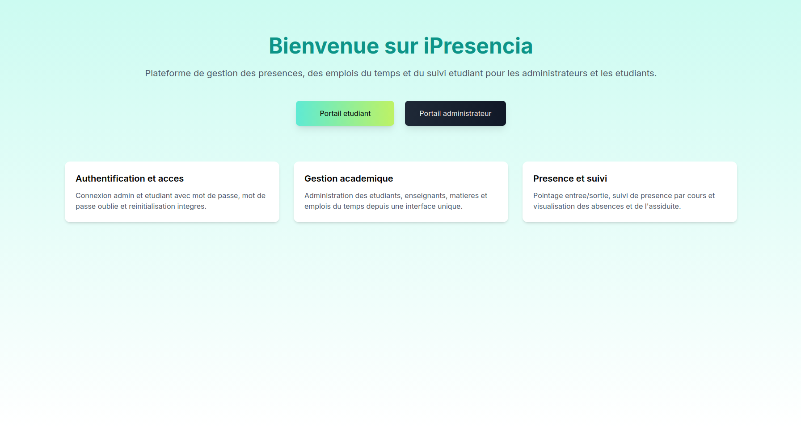
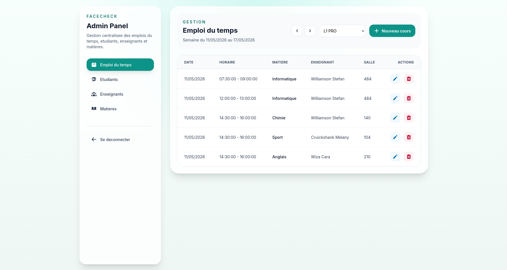
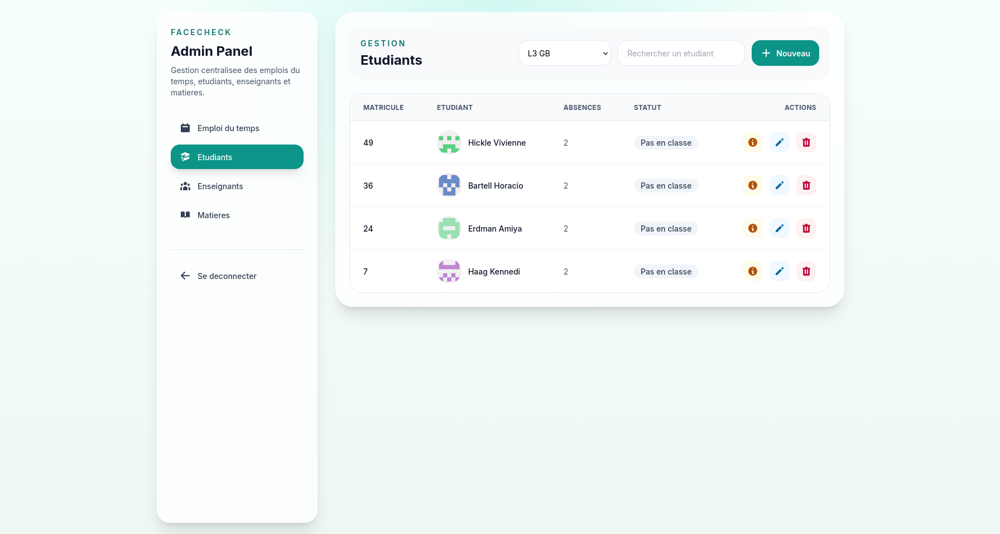
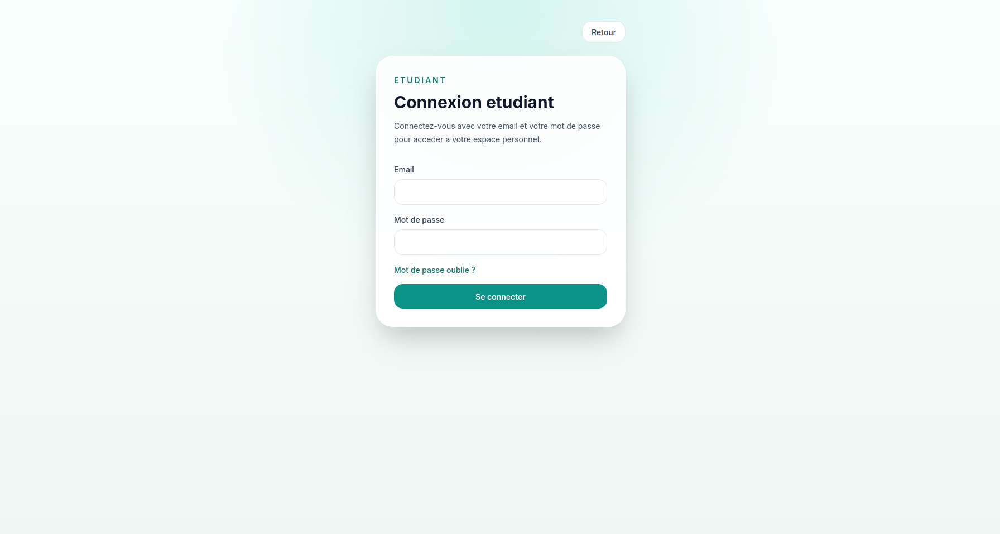
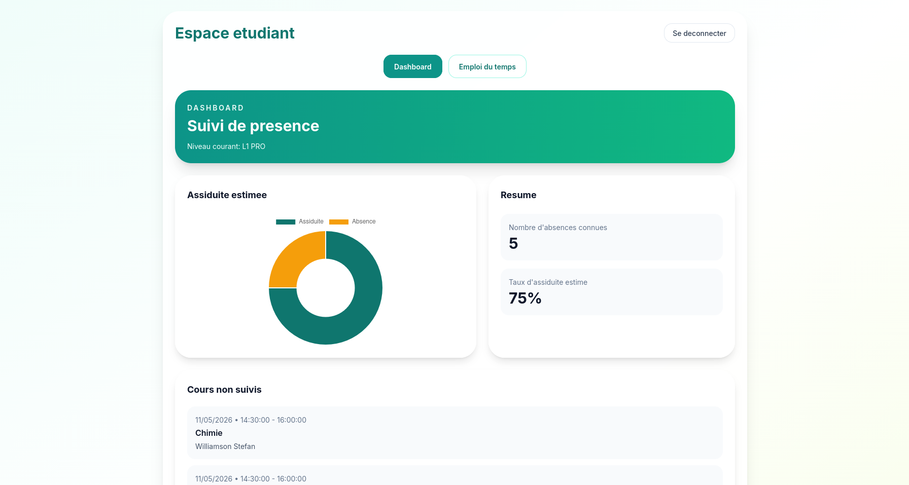
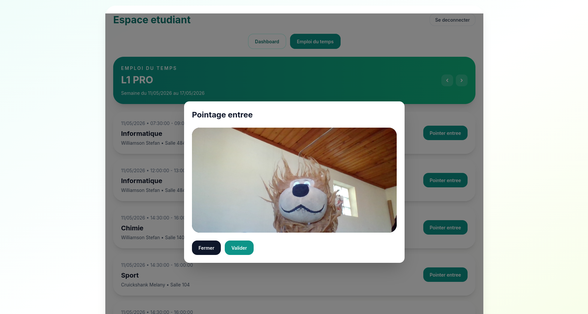

# Facecheck Frontend

Frontend Next.js de l'application **Facecheck / iPresencia**.

Cette interface permet :
- l'accès au portail administrateur
- l'accès au portail étudiant
- la gestion académique côté admin
- le suivi d'assiduité et le pointage côté étudiant

## Stack technique

- Next.js 14
- React 18
- TypeScript
- Tailwind CSS
- Framer Motion
- SweetAlert2
- Face API.js

## Structure

- `app/` : routes App Router
- `app/admin/` : pages du portail administrateur
- `app/etudiant/` : pages du portail étudiant
- `components/` : composants réutilisables
- `lib/` : API client, types, session, utilitaires
- `public/` : assets publics et modèles de reconnaissance faciale

## Prérequis

- Node.js 18+ recommandé
- backend Facecheck démarré

## Installation

```bash
cd Facecheck-frontend
npm install
```

## Variables d'environnement

Créer un fichier `.env` dans `Facecheck-frontend/`.

Exemple :

```env
NEXT_PUBLIC_BACK_URL=http://localhost:8000

NEXT_PUBLIC_AWS_REGION=eu-west-3
NEXT_PUBLIC_AWS_ACCESS_KEY_ID=your_access_key
NEXT_PUBLIC_AWS_SECRET_ACCESS_KEY=your_secret_key
NEXT_PUBLIC_S3_BUCKET_NAME=your_bucket_name
```

Notes :
- `NEXT_PUBLIC_BACK_URL` doit pointer vers ton backend local
- les variables AWS sont nécessaires si tu utilises l'upload photo vers S3

## Lancer le frontend

```bash
npm run dev
```

Application accessible sur :

```text
http://localhost:3000
```

## Build de production

```bash
npm run build
```

Puis :

```bash
npm start
```

## Vérifications utiles

TypeScript / build :

```bash
npm run build
```

Lint :

```bash
npm run lint
```

## Fonctionnalités actuellement disponibles

## Page d'accueil

- accès au portail étudiant
- accès au portail administrateur
- spinner de chargement pendant la navigation

## Portail administrateur

- connexion par email / mot de passe
- mot de passe oublié
- réinitialisation du mot de passe
- sidebar responsive desktop / mobile
- spinner sur les changements de page du menu
- gestion des emplois du temps
- gestion des étudiants
- gestion des enseignants
- gestion des matières

## Portail étudiant

- connexion par email / mot de passe
- mot de passe oublié
- réinitialisation du mot de passe
- accès protégé par session locale
- dashboard d'assiduité
- consultation des cours non suivis
- consultation de l'emploi du temps hebdomadaire
- pointage d'entrée et de sortie

## Captures d'écran

## Page d'accueil



## Gestion des emplois du temps



## Gestion des étudiants



## Connexion étudiant



## Dashboard étudiant



## Pointage étudiant



## Parcours de test conseillé

1. Démarrer le backend
2. Vérifier `http://localhost:8000/health`
3. Démarrer le frontend
4. Ouvrir `http://localhost:3000`
5. Tester la connexion admin
6. Tester la connexion étudiant
7. Tester les CRUD du portail admin
8. Tester le pointage étudiant

## Comptes de test

Si les seeders backend ont été exécutés, tu peux utiliser :

### Administrateur

- email : `admin@facecheck.local`
- mot de passe : `Admin1234!`

### Étudiant

- email : `etudiant@facecheck.local`
- mot de passe : `Etudiant1234!`

## Dépendances notables

- `face-api.js` pour la reconnaissance faciale
- `aws-sdk` / S3 pour l'upload d'images étudiant
- `chart.js` pour le dashboard étudiant

## Dépannage rapide

### Erreur CORS

Vérifie que :

- le backend tourne bien
- `NEXT_PUBLIC_BACK_URL` pointe vers le bon port
- le backend autorise `http://localhost:3000`

### Les pages admin ou étudiant redirigent vers le login

Les portails utilisent une session stockée localement. Reconnecte-toi si nécessaire.

### Le build frontend échoue à cause du backend

Assure-toi que les routes et variables d'environnement sont cohérentes avec le backend local.
